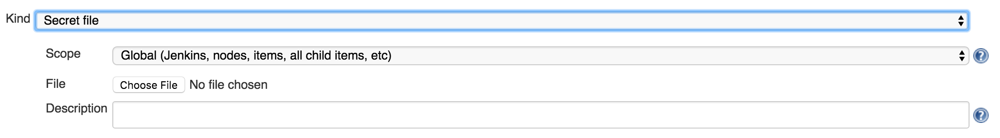
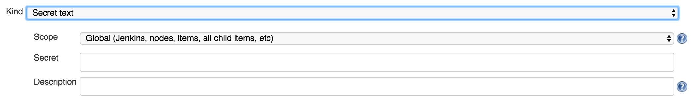

# Jenkins Plain Credentials Plugin

 Allows use of plain strings and files as credentials to be passed to miscellaneous build steps. See also this [plugin's wiki page][wiki]

## Description

This plugin provides two new types of credentials:

-   `FileCredentials` or *Secret file*:

  

-   `StringCredentials` or *Secret text*:

  

## Usage

These credentials were originally designed to be used together with the
[Credentials Binding
Plugin](https://plugins.jenkins.io/credentials-binding).
See the
[plugin](https://plugins.jenkins.io/credentials-binding){.external-link}
for an example use case.

However, as described in the [Credentials
Plugin](https://plugins.jenkins.io/credentials)
wiki, they could potentially be used by any other plugin that requires
them.

# Environment

The following build environment is required to build this plugin

* `java-1.6` and `maven-3.0.5`

# Build

To build the plugin locally:

    mvn clean verify

# Release

To release the plugin:

    mvn release:prepare release:perform -B

# Test local instance

To test in a local Jenkins instance

    mvn hpi:run

